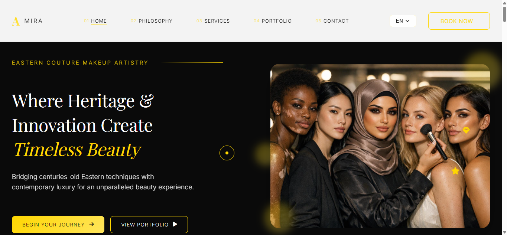

# 🎨 AMIRA STUDIO – Luxury Makeup Artist Website


A premium, multilingual portfolio website for luxury makeup artist Amira, featuring elegant design, interactive galleries, and seamless language switching between English, Swedish, and Arabic.

## 🌍 Live Demo
👉 **[View Live Website](https://ghostlayer168.github.io/makeup-artist-website-amira/en/index.html)**  
*Replace with your actual GitHub Pages URL*

## 📸 Website Preview
  
*Elegant hero section showcasing luxury makeup artistry*

## ✨ Key Features

### 🌐 **Complete Multilingual Experience**
- **Three Full Language Versions**: English, Swedish, and Arabic
- **RTL Support**: Perfect Arabic layout with right-to-left text direction
- **Language Persistence**: Remembers user's language preference
- **Consistent Navigation**: Seamless switching between all versions

### 🎨 **Premium Design & Interactions**
- **Custom Interactive Cursor**: Luxury cursor with hover animations
- **GSAP Animations**: Smooth, professional-grade animations
- **Responsive Layout**: Flawless experience on all device sizes
- **Elegant Transitions**: Page transitions and loading animations

### 📱 **Interactive Components**
- **Filterable Gallery**: Categorize by bridal, editorial, events, etc.
- **Image Lightbox**: Full-screen modal for detailed image viewing
- **Service Navigation**: Easy section navigation on services page
- **FAQ Accordion**: Expandable FAQ section for common questions

### ⚡ **Performance Optimized**
- **Fast Loading**: Optimized images and assets
- **No Dependencies**: Pure HTML/CSS/JS implementation
- **Clean Code**: Well-structured and commented codebase
- **Cross-Browser**: Compatible with all modern browsers

## 📁 Complete Project Structure
makeup-artist-website-amira/
├── favicon.ico
├── README.md
├── ar/
│ ├── gallery_ar.html
│ ├── index_ar.html
│ ├── services_ar.html
│ ├── css/
│ │ ├── gallery-rtl.css
│ │ ├── rtl.css
│ │ └── services-rtl.css
│ └── js/
│ ├── gallery_ar.js
│ ├── main-ar.js
│ └── services-ar.js
├── en/
│ ├── gallery.html
│ ├── index.html
│ ├── services.html
│ ├── css/
│ │ ├── gallery.css
│ │ ├── services.css
│ │ └── style.css
│ └── js/
│ ├── gallery.js
│ ├── main.js
│ └── services.js
├── sv/
│ ├── gallery_sv.html
│ ├── index_sv.html
│ ├── services_sv.html
│ └── js/
│ ├── gallery.js
│ ├── main.js
│ └── services.js
└── images/
├── bridal-1.jpg
├── bridal-2.jpg
├── bridal-3.jpg
├── bridal-4.jpg
├── bridal-5.jpg
├── bridal-showcase.jpg
├── bridal.jpg
├── client-1.jpg
├── client-2.jpg
├── client-3.jpg
├── consultation-1.jpg
├── consultation-2.jpg
├── consultation-3.jpg
├── editorial-1.jpg
├── editorial-2.jpg
├── editorial-3.jpg
├── editorial-4.jpg
├── editorial-5.jpg
├── editorial-artistry.jpg
├── editorial-showcase.jpg
├── event-1.jpg
├── event-2.jpg
├── event-3.jpg
├── event-4.jpg
├── event-5.jpg
├── hero-1.jpg
├── master-class-1.jpg
├── master-class-2.jpg
├── master-class-3.jpg
├── master-class.jpg
├── special-1.jpg
├── special-2.jpg
├── special-3.jpg
├── special-4.jpg
├── traditional-1.jpg
├── traditional-2.jpg
├── traditional-3.jpg
├── traditional-4.jpg
├── traditional-5.jpg
└── traditional-showcase.jpg


## 🛠️ Technology Stack

### Frontend
- **HTML5**: Semantic, accessible markup
- **CSS3**: Modern styling with Flexbox & Grid layouts
- **JavaScript (ES6+)**: Interactive functionality and animations
- **GSAP (GreenSock)**: Professional animation library

### Design & UX
- **Responsive Design**: Mobile-first approach
- **Custom Cursor**: Interactive cursor effects
- **Smooth Scrolling**: Enhanced navigation experience
- **Loading Animations**: Professional page transitions

### Internationalization
- **RTL Support**: Complete Arabic language support
- **Language Switching**: Seamless between EN/SV/AR
- **LocalStorage**: User preference persistence
- **Culture-Specific Design**: Adapted layouts for each language

## 📄 Page Details

### 🏠 **Homepage (`index.html`)**
- Hero section with captivating background
- Philosophy/About section
- Services preview with call-to-action
- Portfolio highlights gallery
- Client testimonials
- Contact information and booking CTA

### 💼 **Services Page (`services.html`)**
- Detailed descriptions of 5 main services:
  1. **Bridal Couture** – Premium bridal makeup
  2. **Editorial Artistry** – Fashion and magazine makeup
  3. **Special Events** – Red carpet and gala events
  4. **Master Classes** – Professional training
  5. **Personal Consultation** – One-on-one sessions
- Pricing information
- Service-specific galleries
- FAQ section with accordion
- Direct booking buttons

### 🖼️ **Gallery Page (`gallery.html`)**
- Categorized image gallery
- **Filter Categories**:
  - Bridal Makeup
  - Editorial Artistry
  - Traditional Makeup
  - Special Events
  - Master Classes
- **Sorting Options**:
  - Newest first
  - Oldest first
  - Featured items
  - By category
- Modal lightbox for full-screen viewing
- Image descriptions and details
- Load more functionality

## 🌐 Language Implementation

| Language | Code | Direction | Status     | Features                          |
|----------|------|-----------|------------|-----------------------------------|
| English  | `en` | LTR       | ✅ Complete | Default language, complete content |
| Swedish  | `sv` | LTR       | ✅ Complete | Full translation, same structure  |
| Arabic   | `ar` | RTL       | ✅ Complete | Full RTL support, Arabic fonts    |

### Language Switching Features:
- **Top Navigation**: Language selector in header
- **Mobile Menu**: Language options in mobile navigation
- **URL Routing**: Direct access to language versions
- **Session Memory**: Remembers user's language choice
- **Smooth Transition**: Animated language switching

## 🚀 Getting Started

### Prerequisites
- Any modern web browser (Chrome, Firefox, Safari, Edge)
- No server or build tools required

### Installation & Local Development
1. **Clone the repository**
   ```bash
   git clone https://github.com/ghostlayer168/makeup-artist-website-amira.git
   cd makeup-artist-website-amira
Open in browser

bash
# Open English version (default)
open en/index.html

# Or simply navigate to the folder and open index.html
Development Workflow
Edit HTML files in /en, /sv, or /ar directories

Modify CSS in respective css/ folders

Update JavaScript in respective js/ folders

Test changes by refreshing the browser

Viewing Different Languages
English: http://localhost/en/index.html

Swedish: http://localhost/sv/index_sv.html

Arabic: http://localhost/ar/index_ar.html

🎯 Development Notes
Code Architecture
Modular JavaScript: Separate files for each page

CSS Organization: Page-specific stylesheets

Image Optimization: All images compressed for web

Accessibility: Semantic HTML and ARIA labels

SEO Friendly: Proper meta tags and structure

Key JavaScript Modules
Main Navigation Module – Handles mobile menu, scrolling, language switching

Gallery Module – Manages filtering, sorting, and modal functionality

Services Module – Service navigation and FAQ interactions

Cursor Module – Custom interactive cursor effects

Language Module – Manages multilingual functionality

CSS Architecture
Base Styles (style.css): Typography, colors, layout

Component Styles: Reusable UI components

Page-specific Styles: Unique page layouts

RTL Overrides: Arabic language specific adjustments

📱 Responsive Breakpoints
Mobile: < 768px (optimized for touch)

Tablet: 768px – 1199px (adaptive layouts)

Desktop: 1200px+ (full feature experience)

## 🖼️ Image Assets Overview
- **Total:** 40+ professional makeup images
- **Type:** AI-generated by the author (no real models)
- **License:** Included for use within this template
- **Categories:**
  - Bridal Makeup: 5 AI-generated bridal looks
  - Editorial Artistry: 5 fashion/editorial images
  - Traditional Makeup: 5 cultural/traditional styles
  - Special Events: 5 red carpet/event looks
  - Master Classes: 3 workshop/training images
  - Consultations: 3 session demonstration images
  - Hero Images: Multiple background variations
  - Client Photos: 3 AI-generated testimonial images

**Note:** All images are AI-generated. No model releases required.
🔧 Customization Guide
Adding New Images to Gallery
Add image file to /images/ folder

Update gallery HTML with new item:

html
<div class="gallery-item" data-category="bridal" data-date="2024-01-15">
  
  <div class="image-info">
    <h3 class="image-title">New Image Title</h3>
    <span class="image-category">Bridal</span>
    <span class="image-date">January 2024</span>
  </div>
</div>
Adding New Language
Create new language folder (e.g., /fr/ for French)

Copy structure from /en/ folder

Translate all text content

Update language selector in all versions

Test RTL if needed for the language

Updating Service Information
Edit /en/services.html for English

Synchronize changes to /sv/services_sv.html

Synchronize changes to /ar/services_ar.html

Update any related CSS/JS files

🐛 Troubleshooting
Common Issues & Solutions
Issue	Solution
Language not switching	Clear browser cache and localStorage
Images not loading	Check image paths and file names
Mobile menu not working	Check JavaScript console for errors
RTL layout broken	Ensure rtl.css is properly linked
Animations not working	Verify GSAP is loaded correctly
Browser Compatibility
✅ Chrome 80+

✅ Firefox 75+

✅ Safari 13+

✅ Edge 80+

✅ Mobile Chrome & Safari

## 📄 License
This is a **premium template** available for purchase.

**Usage Rights:**
- ✅ Single website use
- ✅ Personal or commercial projects
- ✅ Customization allowed
- ✅ Lifetime updates (with support period)

**Prohibited:**
- ❌ Resale or redistribution
- ❌ Multi-project use
- ❌ SaaS applications
- ❌ Template marketplace sales

For licensing inquiries: oleksandrazdoronok@gmail.com
**Full License:** See [LICENSE.md](LICENSE.md) for complete terms.

🤝 Contributing
While this is a personal portfolio project, suggestions are welcome:

Fork the repository

Create a feature branch

Commit your changes

Push to the branch

Open a Pull Request

📞 Contact & Support
Project Owner
Name: Oleksandra Zdoronok

Email: oleksandrazdoronok@gmail.com


Technical Support
For technical issues or questions about the codebase:

Open an issue on GitHub

Provide detailed description of the problem

Include browser and device information

🙏 Acknowledgments
Clients & Models: For allowing use of their images

Photographers: Professional photography work

GSAP Team: For the amazing animation library

Font Awesome: Beautiful icon set

Open Source Community: For inspiration and tools

🌟 Why This Project Stands Out
Complete Multilingual Implementation – Not just translation, but full RTL support and cultural adaptation

Premium User Experience – From custom cursor to smooth animations

Professional Image Gallery – Filterable, sortable, with lightbox viewing

Clean, Maintainable Code – Well-organized structure for easy updates

Performance Focused – Optimized assets and fast loading times

Fully Responsive – Perfect experience on any device

